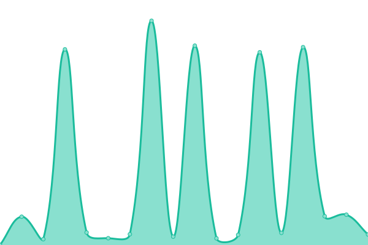

# [📈 Live Status](https://www.hanseyachtsag.com): <!--live status--> **🟧 Partial outage**

This repository contains the open-source uptime monitor and status page for [pgedeon](https://null.pictures), powered by [Upptime](https://github.com/upptime/upptime).

With [Upptime](https://upptime.js.org), you can get your own unlimited and free uptime monitor and status page, powered entirely by a GitHub repository. We use [Issues](https://github.com/pgedeon/hyag/issues) as incident reports, [Actions](https://github.com/pgedeon/hyag/actions) as uptime monitors, and [Pages](https://www.hanseyachtsag.com) for the status page.

<!--start: status pages-->
<!-- This summary is generated by Upptime (https://github.com/upptime/upptime) -->
<!-- Do not edit this manually, your changes will be overwritten -->
<!-- prettier-ignore -->
| URL | Status | History | Response Time | Uptime |
| --- | ------ | ------- | ------------- | ------ |
|  [HYAG](https://www.hanseyachtsag.com/us/) | 🟩 Up | [hyag.yml](https://github.com/pgedeon/hyag/commits/HEAD/history/hyag.yml) | 

 511ms
     
 | 

<a href="https://www.hanseyachtsag.com/history/hyag">100.00%</a>
    

|  [HYAG Shop](https://shop.hanseyachtsag.com/) | 🟩 Up | [hyag-shop.yml](https://github.com/pgedeon/hyag/commits/HEAD/history/hyag-shop.yml) | 

 453ms
     
 | 

<a href="https://www.hanseyachtsag.com/history/hyag-shop">100.00%</a>
    

|  [Hanse Yachts](https://www.hanseyachtsag.com/hanse/us/) | 🟩 Up | [hanse-yachts.yml](https://github.com/pgedeon/hyag/commits/HEAD/history/hanse-yachts.yml) | 

 32ms
     
 | 

<a href="https://www.hanseyachtsag.com/history/hanse-yachts">100.00%</a>
    

|  [Moody Boats](https://www.hanseyachtsag.com/moody/us/) | 🟩 Up | [moody-boats.yml](https://github.com/pgedeon/hyag/commits/HEAD/history/moody-boats.yml) | 

 18ms
     
 | 

<a href="https://www.hanseyachtsag.com/history/moody-boats">100.00%</a>
    

|  [Dehler Yachts](https://www.hanseyachtsag.com/dehler/us/) | 🟩 Up | [dehler-yachts.yml](https://github.com/pgedeon/hyag/commits/HEAD/history/dehler-yachts.yml) | 

 22ms
     
 | 

<a href="https://www.hanseyachtsag.com/history/dehler-yachts">100.00%</a>
    

|  [FJORD Boats](https://www.hanseyachtsag.com/fjord/us/) | 🟩 Up | [fjord-boats.yml](https://github.com/pgedeon/hyag/commits/HEAD/history/fjord-boats.yml) | 

 18ms
     
 | 

<a href="https://www.hanseyachtsag.com/history/fjord-boats">100.00%</a>
    

|  [SEALINE](https://www.hanseyachtsag.com/sealine/us/) | 🟩 Up | [sealine.yml](https://github.com/pgedeon/hyag/commits/HEAD/history/sealine.yml) | 

 23ms
     
 | 

<a href="https://www.hanseyachtsag.com/history/sealine">100.00%</a>
    

|  [RYCK](https://www.hanseyachtsag.com/ryck/us/) | 🟩 Up | [ryck.yml](https://github.com/pgedeon/hyag/commits/HEAD/history/ryck.yml) | 

 18ms
     
 | 

<a href="https://www.hanseyachtsag.com/history/ryck">100.00%</a>
    

|  [HYAG Ping](212.237.244.91) | 🟩 Up | [hyag-ping.yml](https://github.com/pgedeon/hyag/commits/HEAD/history/hyag-ping.yml) | 

 125ms
     
 | 

<a href="https://www.hanseyachtsag.com/history/hyag-ping">100.00%</a>
    

|  [Fraser Yachts](https://www.fraseryachts.com/) | 🟥 Down | [fraser-yachts.yml](https://github.com/pgedeon/hyag/commits/HEAD/history/fraser-yachts.yml) | 

 2429ms
     
 | 

<a href="https://www.hanseyachtsag.com/history/fraser-yachts">100.00%</a>
    

|  [Beneteau](https://www.beneteau.com/us) | 🟩 Up | [beneteau.yml](https://github.com/pgedeon/hyag/commits/HEAD/history/beneteau.yml) | 

 857ms
     
 | 

<a href="https://www.hanseyachtsag.com/history/beneteau">99.85%</a>
    

<!--end: status pages-->

[**Visit our status website →**](https://www.hanseyachtsag.com)

## 📄 License

- Powered by: [Upptime](https://github.com/upptime/upptime)
- Code: [MIT](./LICENSE) © [pgedeon](https://null.pictures)
- Data in the `./history` directory: [Open Database License](https://opendatacommons.org/licenses/odbl/1-0/)
