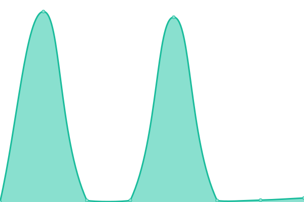

# [📈 Live Status](https://www.hanseyachtsag.com): <!--live status--> **🟧 Partial outage**

This repository contains the open-source uptime monitor and status page for [pgedeon](https://null.pictures), powered by [Upptime](https://github.com/upptime/upptime).

With [Upptime](https://upptime.js.org), you can get your own unlimited and free uptime monitor and status page, powered entirely by a GitHub repository. We use [Issues](https://github.com/pgedeon/hyag/issues) as incident reports, [Actions](https://github.com/pgedeon/hyag/actions) as uptime monitors, and [Pages](https://www.hanseyachtsag.com) for the status page.

<!--start: status pages-->
<!-- This summary is generated by Upptime (https://github.com/upptime/upptime) -->
<!-- Do not edit this manually, your changes will be overwritten -->
<!-- prettier-ignore -->
| URL | Status | History | Response Time | Uptime |
| --- | ------ | ------- | ------------- | ------ |
|  [HYAG](https://www.hanseyachtsag.com/us/) | 🟥 Down | [hyag.yml](https://github.com/pgedeon/hyag/commits/HEAD/history/hyag.yml) | 

 3639ms
     
 | 

<a href="https://www.hanseyachtsag.com/history/hyag">97.97%</a>
    

|  [HYAG Shop](https://shop.hanseyachtsag.com/) | 🟩 Up | [hyag-shop.yml](https://github.com/pgedeon/hyag/commits/HEAD/history/hyag-shop.yml) | 

 519ms
     
 | 

<a href="https://www.hanseyachtsag.com/history/hyag-shop">100.00%</a>
    

|  [Hanse Yachts](https://www.hanseyachtsag.com/hanse/us/) | 🟥 Down | [hanse-yachts.yml](https://github.com/pgedeon/hyag/commits/HEAD/history/hanse-yachts.yml) | 

 2840ms
     
 | 

<a href="https://www.hanseyachtsag.com/history/hanse-yachts">98.01%</a>
    

|  [Moody Boats](https://www.hanseyachtsag.com/moody/us/) | 🟥 Down | [moody-boats.yml](https://github.com/pgedeon/hyag/commits/HEAD/history/moody-boats.yml) | 

 3094ms
     
 | 

<a href="https://www.hanseyachtsag.com/history/moody-boats">98.49%</a>
    

|  [Dehler Yachts](https://www.hanseyachtsag.com/dehler/us/) | 🟥 Down | [dehler-yachts.yml](https://github.com/pgedeon/hyag/commits/HEAD/history/dehler-yachts.yml) | 

 2987ms
     
 | 

<a href="https://www.hanseyachtsag.com/history/dehler-yachts">98.51%</a>
    

|  [Privilege](https://www.hanseyachtsag.com/privilege/us/) | 🟥 Down | [privilege.yml](https://github.com/pgedeon/hyag/commits/HEAD/history/privilege.yml) | 

 5310ms
     
 | 

<a href="https://www.hanseyachtsag.com/history/privilege">0.00%</a>
    

|  [FJORD Boats](https://www.hanseyachtsag.com/fjord/us/) | 🟥 Down | [fjord-boats.yml](https://github.com/pgedeon/hyag/commits/HEAD/history/fjord-boats.yml) | 

 1865ms
     
 | 

<a href="https://www.hanseyachtsag.com/history/fjord-boats">98.86%</a>
    

|  [SEALINE](https://www.hanseyachtsag.com/sealine/us/) | 🟥 Down | [sealine.yml](https://github.com/pgedeon/hyag/commits/HEAD/history/sealine.yml) | 

 2243ms
     
 | 

<a href="https://www.hanseyachtsag.com/history/sealine">99.02%</a>
    

|  [RYCK](https://www.hanseyachtsag.com/ryck/us/) | 🟥 Down | [ryck.yml](https://github.com/pgedeon/hyag/commits/HEAD/history/ryck.yml) | 

 969ms
     
 | 

<a href="https://www.hanseyachtsag.com/history/ryck">99.04%</a>
    

|  [HYAG Ping](212.237.244.91) | 🟥 Down | [hyag-ping.yml](https://github.com/pgedeon/hyag/commits/HEAD/history/hyag-ping.yml) | 

 0ms
     
 | 

<a href="https://www.hanseyachtsag.com/history/hyag-ping">0.00%</a>
    

|  [AG Sailboats](https://www.hanseyachtsag.com/us/sailboats/) | 🟥 Down | [ag-sailboats.yml](https://github.com/pgedeon/hyag/commits/HEAD/history/ag-sailboats.yml) | 

 5459ms
     
 | 

<a href="https://www.hanseyachtsag.com/history/ag-sailboats">99.07%</a>
    

|  [AG Catamarans](https://www.hanseyachtsag.com/us/catamarans/) | 🟥 Down | [ag-catamarans.yml](https://github.com/pgedeon/hyag/commits/HEAD/history/ag-catamarans.yml) | 

 5625ms
     
 | 

<a href="https://www.hanseyachtsag.com/history/ag-catamarans">0.00%</a>
    

|  [AG Motorboats](https://www.hanseyachtsag.com/us/motorboats/) | 🟥 Down | [ag-motorboats.yml](https://github.com/pgedeon/hyag/commits/HEAD/history/ag-motorboats.yml) | 

 5048ms
     
 | 

<a href="https://www.hanseyachtsag.com/history/ag-motorboats">99.10%</a>
    

|  [AG Yachts](https://www.hanseyachtsag.com/us/yachts/) | 🟥 Down | [ag-yachts.yml](https://github.com/pgedeon/hyag/commits/HEAD/history/ag-yachts.yml) | 

 4236ms
     
 | 

<a href="https://www.hanseyachtsag.com/history/ag-yachts">0.00%</a>
    

|  [AG Brands](https://www.hanseyachtsag.com/us/brands/) | 🟥 Down | [ag-brands.yml](https://github.com/pgedeon/hyag/commits/HEAD/history/ag-brands.yml) | 

 4252ms
     
 | 

<a href="https://www.hanseyachtsag.com/history/ag-brands">99.13%</a>
    

|  [AG Hanse](https://www.hanseyachtsag.com/us/brands/hanse/) | 🟥 Down | [ag-hanse.yml](https://github.com/pgedeon/hyag/commits/HEAD/history/ag-hanse.yml) | 

 238ms
     
 | 

<a href="https://www.hanseyachtsag.com/history/ag-hanse">99.14%</a>
    

|  [AG Dehler](https://www.hanseyachtsag.com/us/brands/dehler/) | 🟥 Down | [ag-dehler.yml](https://github.com/pgedeon/hyag/commits/HEAD/history/ag-dehler.yml) | 

 255ms
     
 | 

<a href="https://www.hanseyachtsag.com/history/ag-dehler">99.16%</a>
    

|  [AG Moody](https://www.hanseyachtsag.com/us/brands/moody/) | 🟥 Down | [ag-moody.yml](https://github.com/pgedeon/hyag/commits/HEAD/history/ag-moody.yml) | 

 577ms
     
 | 

<a href="https://www.hanseyachtsag.com/history/ag-moody">99.18%</a>
    

|  [AG Privilege](https://www.hanseyachtsag.com/us/brands/privilege/) | 🟥 Down | [ag-privilege.yml](https://github.com/pgedeon/hyag/commits/HEAD/history/ag-privilege.yml) | 

 5254ms
     
 | 

<a href="https://www.hanseyachtsag.com/history/ag-privilege">0.00%</a>
    

|  [AG FJORD](https://www.hanseyachtsag.com/us/brands/fjord/) | 🟥 Down | [ag-fjord.yml](https://github.com/pgedeon/hyag/commits/HEAD/history/ag-fjord.yml) | 

 239ms
     
 | 

<a href="https://www.hanseyachtsag.com/history/ag-fjord">99.50%</a>
    

|  [AG SEALINE](https://www.hanseyachtsag.com/us/brands/sealine/) | 🟥 Down | [ag-sealine.yml](https://github.com/pgedeon/hyag/commits/HEAD/history/ag-sealine.yml) | 

 236ms
     
 | 

<a href="https://www.hanseyachtsag.com/history/ag-sealine">99.51%</a>
    

|  [AG RYCK](https://www.hanseyachtsag.com/us/brands/ryck/) | 🟥 Down | [ag-ryck.yml](https://github.com/pgedeon/hyag/commits/HEAD/history/ag-ryck.yml) | 

 892ms
     
 | 

<a href="https://www.hanseyachtsag.com/history/ag-ryck">99.52%</a>
    

|  [Fraser Yachts](https://www.fraseryachts.com/) | 🟩 Up | [fraser-yachts.yml](https://github.com/pgedeon/hyag/commits/HEAD/history/fraser-yachts.yml) | 

 2018ms
     
 | 

<a href="https://www.hanseyachtsag.com/history/fraser-yachts">100.00%</a>
    

|  [Beneteau](https://www.beneteau.com/us) | 🟩 Up | [beneteau.yml](https://github.com/pgedeon/hyag/commits/HEAD/history/beneteau.yml) | 

 1488ms
     
 | 

<a href="https://www.hanseyachtsag.com/history/beneteau">99.81%</a>
    

<!--end: status pages-->

[**Visit our status website →**](https://www.hanseyachtsag.com)

## 📄 License

- Powered by: [Upptime](https://github.com/upptime/upptime)
- Code: [MIT](./LICENSE) © [pgedeon](https://null.pictures)
- Data in the `./history` directory: [Open Database License](https://opendatacommons.org/licenses/odbl/1-0/)
